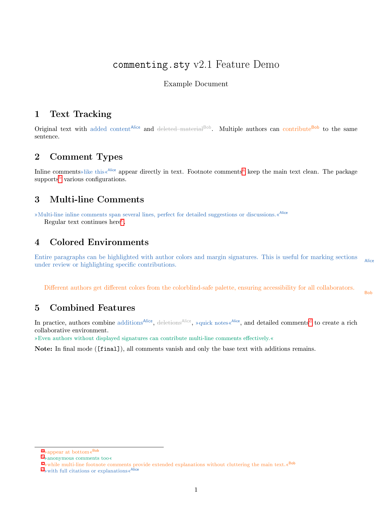

# commenting.sty



**Version 2.2** · Collaborative annotation tools for LaTeX manuscripts

[](LICENSE)

---

## Features

- **Text tracking** — Mark additions and deletions with author colors and signatures
- **Inline comments** — Highlighted notes directly in the text flow
- **Footnote comments** — Alphabetic markers with clickable bidirectional links
- **Multi-line environments** — Extended comment blocks and footnotes
- **Colored paragraphs** — Highlight entire sections with margin signatures
- **Draft/final toggle** — All markup vanishes cleanly in final mode
- **Colorblind-safe palette** — 10 CVD-friendly colors for accessibility
- **Sepia background** — Optional warm background for comfortable editing
- **TODO lists** — Checkbox environment with progress markers

## Quick Start

```latex
\usepackage[draft]{commenting}
\registerauthor{alice}[Alice][cbBlue]
\registerauthor{bob}[Bob][cbOrange]

The \bobdel{old}\bob{new} method is \alice{significantly} faster.
\alicei{Verify this claim.} \bobf{Add citation here.}
```

## Installation

Copy `commenting.sty` to your project directory or TeX path, then:

```latex
\usepackage[draft]{commenting}          % Show all annotations
\usepackage[draft,bg=sepia]{commenting} % With sepia background
\usepackage[final]{commenting}          % Hide all annotations
```

---

## Commands Reference

### Author Registration

```latex
\registerauthor{id}[Display Name][color]
```

Creates a command suite for each author:

| Command | Purpose | Final Mode |
|---------|---------|------------|
| `\alice{text}` | Added text | Text remains |
| `\alicedel{text}` | Deleted text | Removed |
| `\alicei{note}` | Inline comment | Hidden |
| `\alicef{note}` | Footnote comment | Hidden |
| `aliceenv` | Colored block | Plain text |
| `aliceienv` | Multi-line inline | Hidden |
| `alicefenv` | Multi-line footnote | Hidden |

### TODO Lists

```latex
\begin{todolist}
  \item Pending task
  \item[\doing] In progress
  \item[\done] Completed
\end{todolist}
```

A `todo` author is pre-registered: `\todoi{Fix this.}`

---

## Color Palette

Ten colorblind-safe colors for accessibility:

| Color | Name | Color | Name |
|-------|------|-------|------|
| 🔵 | `cbBlue` | 🟢 | `cbGreen` |
| 🟠 | `cbOrange` | 🟡 | `cbYellow` |
| 🔴 | `cbRed` | 🩷 | `cbPink` |
| 🟣 | `cbPurple` | 🟤 | `cbBrown` |
| 🩵 | `cbTeal` | ⚫ | `cbGray` |

---

## Package Options

| Option | Effect |
|--------|--------|
| `draft` | Show all markup (default if document class is draft) |
| `final` | Hide all markup (default if document class is final) |
| `bg=sepia` | Apply sepia page background in draft mode |

---

## Documentation

- **`example.tex`** — Quick one-page demo
- **`documentation.tex`** — Complete feature walkthrough

---

## Requirements

Standard TeX Live / MiKTeX packages: `xcolor`, `soul`, `hyperref`, `ulem`, `xparse`, `mdframed`, `manyfoot`, `marginnote`, `environ`

Compatible with pdfLaTeX, XeLaTeX, and LuaLaTeX.

---

## Version History

| Version | Date | Changes |
|---------|------|---------|
| 2.2 | 2025-11-26 | Sepia background, soul highlighting, documentation overhaul |
| 2.1 | 2025-08-06 | Documentation improvements |
| 2.0 | 2025-01-21 | Robust commands, xparse integration |

---

## License

MIT License — see [LICENSE](LICENSE)

## Citation

```bibtex
@misc{commenting2025,
  author = {Lee, Jae Hee},
  title  = {commenting.sty: Collaborative annotation tools for LaTeX},
  year   = {2025},
  url    = {https://github.com/dschaehi/commenting.sty}
}
```
